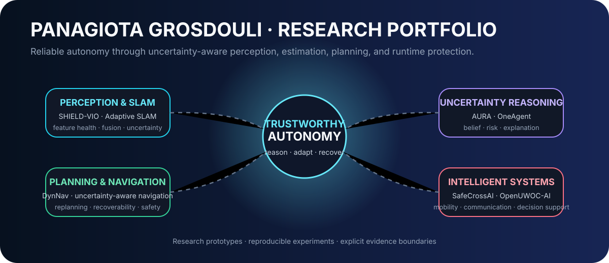
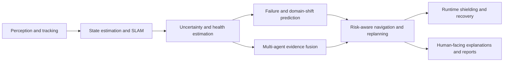

<div align="center">

# Panagiota Grosdouli

### Robotics · Autonomous Navigation · Uncertainty-Aware AI · Safety-Oriented Autonomy

<p>
  
</p>

<p>
  <a href="mailto:panagros1@ee.duth.gr"></a>
  <a href="https://www.linkedin.com/in/panagiota-grosdouli-b468b0201/"></a>
  <a href="https://panagiota-research-portfolio.vercel.app/"></a>
  <a href="https://www.researchgate.net/profile/Panagiota-Grosdouli"></a>
</p>

</div>

## Research profile

I develop open research software for autonomous systems that must act under incomplete information, changing environments, degraded sensing, uncertain predictions, and limited recovery options. The public repositories on this account form a connected robotics and AI research ecosystem spanning perception, state estimation, motion forecasting, navigation, runtime supervision, multi-agent coordination, and reproducible experimentation.

> **Central question:** How can an autonomous system represent what it does not know, propagate that uncertainty through the autonomy stack, and convert it into safer, interpretable real-time decisions?

The work is deliberately evidence-conscious. Synthetic demonstrations, dataset experiments, and research prototypes are clearly separated from physical-robot validation, production readiness, and formal safety guarantees.

## Research interests

| Research axis | Current themes |
|---|---|
| **Autonomous navigation** | dynamic replanning, risk-aware search, recoverability, belief-space reasoning |
| **Robot perception and localization** | visual–inertial estimation, multi-modal SLAM, sensor-health diagnostics |
| **Uncertainty and safety** | calibration, NIS/NEES, domain shift, runtime shields, safe-mode supervision |
| **Computer vision and prediction** | feature tracking, trajectory forecasting, vulnerable-road-user safety |
| **Learning for autonomy** | PyTorch models, reinforcement-learning prototypes, learned heuristics |
| **Multi-agent systems** | communication-aware coordination, shared evidence, task allocation |
| **Open research engineering** | deterministic experiments, tests, CI, manifests, reports, visual evidence |

## Core technologies

**Robotics and autonomy**


**Programming and engineering**


**AI and scientific computing**


> ROS 2, Nav2, Gazebo, MoveIt 2, and hardware deployment are active integration directions; individual repository READMEs define what is currently implemented and validated.

## Featured repositories

| Project | Research role | Stack | Maturity |
|---|---|---|---|
| **[DynNav](https://github.com/panagiotagrosdouli/DynNav)** | Flagship laboratory for risk-aware dynamic navigation, rerouting, uncertainty, recoverability, supervision, and multi-robot experiments | Python · Streamlit · NumPy · Docker · CI | Implemented core + research/experimental modules |
| **[SHIELD-VIO](https://github.com/panagiotagrosdouli/SHIELD-VIO)** | Estimator introspection, failure prediction, calibration, domain-shift monitoring, and protective navigation actions | Python · OpenCV · NumPy · scikit-learn | Research prototype; synthetic validation |
| **[Adaptive Multi-Modal SLAM](https://github.com/panagiotagrosdouli/Adaptive-Multi-Modal-SLAM-with-Uncertainty-Aware-Sensor-Fusion)** | Reliability-aware camera, IMU, LiDAR, and RGB-D fusion with adaptive covariance and consistency diagnostics | Python · NumPy · YAML | Research prototype; synthetic validation |
| **[Uncertainty-Aware Navigation](https://github.com/panagiotagrosdouli/uncertainty-aware-navigation)** | Comparative planning under occupancy uncertainty, spatial risk, and limited recoverability | Python · NumPy · CI | Synthetic research prototype |
| **[SafeCrossAI](https://github.com/panagiotagrosdouli/SafeCrossAI)** | Interpretable VRU trajectory prediction and TTC/CPA interaction-risk reasoning | Python · NumPy · generated media | Research prototype; synthetic demonstration |
| **[Rare-Event VRU Motion Forecasting](https://github.com/panagiotagrosdouli/rare-event-vru-motion-forecasting)** | Tail-aware forecasting for pedestrians, cyclists, and motorcyclists using Argoverse 2 | Python · PyTorch · Argoverse 2 | Dataset research prototype |

## DynNav spotlight

<p align="center">
  
</p>

**[DynNav](https://github.com/panagiotagrosdouli/DynNav)** is the central integration project in this portfolio: a modular research framework and interactive robotics laboratory for autonomous navigation under uncertainty, risk, dynamic change, resource constraints, and mission-level safety actions.

Its architecture connects:

```text
scenario / map / mission
        ↓
occupancy belief and uncertainty
        ↓
risk, connectivity, resources, recoverability
        ↓
classical, learned, semantic, or risk-aware planning
        ↓
dynamic prediction and online replanning
        ↓
continue / caution / replan / recover / stop
        ↓
metrics, event logs, manifests, reports, and evidence audit
```

### Major DynNav modules

| Module | Purpose |
|---|---|
| **[Interactive dashboard](https://github.com/panagiotagrosdouli/DynNav/blob/main/app/dashboard.py)** | Entry point for the multipage Streamlit robotics laboratory |
| **[Dashboard guide](https://github.com/panagiotagrosdouli/DynNav/blob/main/app/README.md)** | Robot Lab, Scenario Builder, Planner Arena, safety labs, experiments, and reporting |
| **[Contribution Explorer](https://github.com/panagiotagrosdouli/DynNav/blob/main/docs/CONTRIBUTION_FEATURE_CATALOG.md)** | Interactive catalog for contributions C01–C26 |
| **[Contribution source index](https://github.com/panagiotagrosdouli/DynNav/blob/main/contributions/CONTRIBUTIONS_README.md)** | Source-level navigation across contribution implementations |
| **[Documentation hub](https://github.com/panagiotagrosdouli/DynNav/blob/main/docs/README.md)** | Research formulation, architecture, evidence boundaries, and usage |
| **[Website module](https://github.com/panagiotagrosdouli/DynNav/blob/main/website/README.md)** | Supporting project website assets and documentation |
| **[Greek documentation](https://github.com/panagiotagrosdouli/DynNav/blob/main/README_GREEK.md)** | Greek-language project overview |

<details>
<summary><strong>DynNav contribution ecosystem</strong></summary>

DynNav currently organizes 26 interactive contribution areas across:

- learned, uncertainty-aware, risk-aware, and recoverability-aware planning;
- finite-state supervision, energy, connectivity, and safe exploration;
- intrusion detection, human-aware navigation, and multi-robot coordination;
- reinforcement learning, world models, diffusion prediction, and federated learning;
- semantic maps, formal safety shields, explanation, adversarial testing, and swarm consensus.

The repository explicitly marks maturity per module and does not claim that all contributions form one certified physical-robot stack.

</details>

## Robotics ecosystem

The public repositories connect into one autonomy pipeline rather than a collection of unrelated demos:



| Ecosystem layer | Repositories |
|---|---|
| **Perception and forecasting** | [SafeCrossAI](https://github.com/panagiotagrosdouli/SafeCrossAI), [Rare-Event VRU Motion Forecasting](https://github.com/panagiotagrosdouli/rare-event-vru-motion-forecasting), [Argoverse ISCAI Predictive Beam ADB](https://github.com/panagiotagrosdouli/argoverse-iscaI-predictive-beam-adb), [Radial-Velocity-Aware ISCAI](https://github.com/panagiotagrosdouli/radial-velocity-aware-iscai) |
| **Localization and mapping** | [SHIELD-VIO](https://github.com/panagiotagrosdouli/SHIELD-VIO), [Adaptive Multi-Modal SLAM](https://github.com/panagiotagrosdouli/Adaptive-Multi-Modal-SLAM-with-Uncertainty-Aware-Sensor-Fusion) |
| **Planning and decision-making** | [DynNav](https://github.com/panagiotagrosdouli/DynNav), [Uncertainty-Aware Navigation](https://github.com/panagiotagrosdouli/uncertainty-aware-navigation), [AURA](https://github.com/panagiotagrosdouli/AURA-Autonomous-Uncertainty-Reasoning-Architecture) |
| **Multi-agent and humanitarian robotics** | [RescueMind](https://github.com/panagiotagrosdouli/RescueMind), [RescueMind Prototype](https://github.com/panagiotagrosdouli/RescueMind-Prototype) |
| **Communication-aware autonomy** | [OpenUWOC-AI](https://github.com/panagiotagrosdouli/OpenUWOC-AI) |
| **Simulation and supporting work** | [Formula 1 Race Simulation](https://github.com/panagiotagrosdouli/formula1-race-simulation), [Personal Portfolio](https://github.com/panagiotagrosdouli/personalportfolio) |

## Research contributions across repositories

The implemented work repeatedly returns to six contribution themes:

1. **Explicit uncertainty representation** — occupancy belief, covariance, estimator consistency, calibration, reliability states, and prediction uncertainty are retained as inspectable signals.
2. **Safety beyond nominal accuracy** — route risk, recoverability, failure lead time, TTC/CPA, warning states, and protective actions complement average-error metrics.
3. **Interpretable supervision** — systems expose why they continue, replan, slow down, hold, relocalize, halt, or request human review.
4. **Degradation-aware autonomy** — sensor faults, domain shift, packet loss, stale evidence, dynamic obstacles, and rare motion are modeled as first-class experimental conditions.
5. **Multi-agent evidence and coordination** — shared beliefs, communication constraints, heterogeneous sensing, task allocation, and consensus appear across navigation and rescue research.
6. **Reproducible evidence pipelines** — repositories preserve seeds, configurations, tests, metrics, figures, GIFs, videos, manifests, and explicit validation boundaries.

## Current projects

Current public work is concentrated on:

- expanding DynNav as an interactive laboratory for planning, uncertainty, runtime safety, multi-robot coordination, and contribution-level experimentation;
- connecting perception health and calibrated failure prediction to navigation protection in SHIELD-VIO;
- adapting multi-modal SLAM fusion when camera, IMU, LiDAR, RGB-D, and timing quality change online;
- studying rare and safety-critical VRU motion rather than reporting only average trajectory error;
- developing uncertainty-aware, human-supervised multi-agent decision support for disaster response;
- moving simulation-first prototypes toward stronger dataset, ROS 2, simulator, and hardware validation without overstating evidence.

## Repository gallery

| Repository | Topic | Primary stack | Status | Documentation | Demo / assets |
|---|---|---|---|---|---|
| [DynNav](https://github.com/panagiotagrosdouli/DynNav) | Autonomous navigation, planning, safety, multi-agent systems | Python / Streamlit | Active research platform | [Docs](https://github.com/panagiotagrosdouli/DynNav/tree/main/docs) | [Dashboard](https://github.com/panagiotagrosdouli/DynNav/tree/main/app) |
| [SHIELD-VIO](https://github.com/panagiotagrosdouli/SHIELD-VIO) | VIO health, failure prediction, runtime shield | Python / OpenCV | Research prototype | [README](https://github.com/panagiotagrosdouli/SHIELD-VIO#readme) | [Assets](https://github.com/panagiotagrosdouli/SHIELD-VIO/tree/main/assets) |
| [Adaptive Multi-Modal SLAM](https://github.com/panagiotagrosdouli/Adaptive-Multi-Modal-SLAM-with-Uncertainty-Aware-Sensor-Fusion) | Reliability-aware sensor fusion | Python | Research prototype | [README](https://github.com/panagiotagrosdouli/Adaptive-Multi-Modal-SLAM-with-Uncertainty-Aware-Sensor-Fusion#readme) | [Assets](https://github.com/panagiotagrosdouli/Adaptive-Multi-Modal-SLAM-with-Uncertainty-Aware-Sensor-Fusion/tree/main/assets) |
| [Uncertainty-Aware Navigation](https://github.com/panagiotagrosdouli/uncertainty-aware-navigation) | Risk and recoverability-aware planning | Python | Synthetic prototype | [README](https://github.com/panagiotagrosdouli/uncertainty-aware-navigation#readme) | [GIF](https://github.com/panagiotagrosdouli/uncertainty-aware-navigation/blob/main/assets/gifs/demo.gif) |
| [AURA](https://github.com/panagiotagrosdouli/AURA-Autonomous-Uncertainty-Reasoning-Architecture) | Uncertainty reasoning and runtime assurance | Python | Research prototype | [README](https://github.com/panagiotagrosdouli/AURA-Autonomous-Uncertainty-Reasoning-Architecture#readme) | [Assets](https://github.com/panagiotagrosdouli/AURA-Autonomous-Uncertainty-Reasoning-Architecture/tree/main/assets) |
| [SafeCrossAI](https://github.com/panagiotagrosdouli/SafeCrossAI) | VRU prediction and interaction risk | Python | Synthetic prototype | [README](https://github.com/panagiotagrosdouli/SafeCrossAI#readme) | [Assets](https://github.com/panagiotagrosdouli/SafeCrossAI/tree/main/assets) |
| [Rare-Event VRU Motion Forecasting](https://github.com/panagiotagrosdouli/rare-event-vru-motion-forecasting) | Tail-event trajectory forecasting | Python / PyTorch | Dataset prototype | [README](https://github.com/panagiotagrosdouli/rare-event-vru-motion-forecasting#readme) | [Pipeline SVG](https://github.com/panagiotagrosdouli/rare-event-vru-motion-forecasting/blob/main/assets/rare_event_vru_pipeline.svg) |
| [Argoverse ISCAI Predictive Beam ADB](https://github.com/panagiotagrosdouli/argoverse-iscaI-predictive-beam-adb) | Predictive vehicle-lighting research | Python | Experimental framework | [README](https://github.com/panagiotagrosdouli/argoverse-iscaI-predictive-beam-adb#readme) | Repository assets |
| [Radial-Velocity-Aware ISCAI](https://github.com/panagiotagrosdouli/radial-velocity-aware-iscai) | Motion-aware predictive beam control | Python | Experimental framework | [README](https://github.com/panagiotagrosdouli/radial-velocity-aware-iscai#readme) | Repository assets |
| [RescueMind](https://github.com/panagiotagrosdouli/RescueMind) | Multi-agent disaster robotics vision | Documentation | Research concept | [Architecture](https://github.com/panagiotagrosdouli/RescueMind/blob/main/docs/ARCHITECTURE.md) | [Roadmap](https://github.com/panagiotagrosdouli/RescueMind/blob/main/ROADMAP.md) |
| [RescueMind Prototype](https://github.com/panagiotagrosdouli/RescueMind-Prototype) | Multi-modal rescue perception and task allocation | Python | Synthetic research prototype | [README](https://github.com/panagiotagrosdouli/RescueMind-Prototype#readme) | [Assets](https://github.com/panagiotagrosdouli/RescueMind-Prototype/tree/main/assets) |
| [OpenUWOC-AI](https://github.com/panagiotagrosdouli/OpenUWOC-AI) | Underwater optical communication and AI receivers | Python / PyTorch | Simulation prototype | [Docs](https://github.com/panagiotagrosdouli/OpenUWOC-AI/tree/main/docs) | [Demo GIF](https://github.com/panagiotagrosdouli/OpenUWOC-AI/blob/main/assets/demo.gif) |
| [Formula 1 Race Simulation](https://github.com/panagiotagrosdouli/formula1-race-simulation) | Strategy and race simulation | Python | Simulation project | [README](https://github.com/panagiotagrosdouli/formula1-race-simulation#readme) | Repository assets |
| [Personal Portfolio](https://github.com/panagiotagrosdouli/personalportfolio) | Web portfolio | Web stack | Supporting project | [README](https://github.com/panagiotagrosdouli/personalportfolio#readme) | [Live portfolio](https://panagiota-research-portfolio.vercel.app/) |
| [Profile README](https://github.com/panagiotagrosdouli/panagiotagrosdouli) | Research landing page | Markdown / SVG | Maintained | This page | Profile asset |

## Skills

| Domain | Methods and capabilities demonstrated in public repositories |
|---|---|
| **Planning** | Dijkstra, A*, learned heuristics, risk-aware objectives, recoverability, rerouting |
| **State estimation** | Kalman filtering, 15-state ESKF, IMU preintegration, covariance adaptation |
| **Uncertainty** | NIS/NEES, calibration, conformal bounds, reliability scoring, domain shift |
| **Computer vision** | feature tracking, trajectory processing, motion statistics, interaction graphs |
| **Machine learning** | GRU forecasting, PyTorch prototypes, logistic models, multi-task learning |
| **Safety engineering** | runtime supervisors, shield states, TTC/CPA, warning lead time, safe fallback |
| **Multi-agent autonomy** | communication-aware allocation, heterogeneous sensing, shared evidence |
| **Research software** | packaging, tests, CI, Docker, deterministic configurations, generated reports |

## Development workflow

```text
research question
      ↓
explicit assumptions and evidence boundary
      ↓
deterministic baseline
      ↓
prototype method and ablations
      ↓
tests, metrics, calibration, and failure cases
      ↓
figures, GIFs, videos, reports, and manifests
      ↓
dataset / simulator / ROS 2 / hardware validation
```

Typical repositories include installable Python packages, versioned configurations, automated tests, reproducible scripts, generated artifacts, bilingual documentation, and clear distinctions among implemented, experimental, planned, and unvalidated components.

## Open-source philosophy

- **Evidence before claims:** synthetic, dataset, simulator, and hardware evidence should never be conflated.
- **Inspectable autonomy:** uncertainty, risk, thresholds, state transitions, and failures should be visible.
- **Baselines before complexity:** learned methods should be compared with transparent deterministic alternatives.
- **Reproducibility as a contribution:** seeds, configurations, commands, software revisions, and outputs belong with every result.
- **Human authority in high-stakes systems:** research tools should support judgment, not conceal uncertainty or replace accountable operators.

## Future roadmap

1. Strengthen ROS 2 and Nav2 interfaces for navigation and supervision experiments.
2. Add Gazebo or comparable simulator validation before physical-robot claims.
3. Connect perception-health and localization-risk outputs to planning and control decisions.
4. Expand public-dataset evaluation for VIO, SLAM, and motion forecasting.
5. Evaluate calibration and domain-shift behavior across repeated seeds and environments.
6. Develop multi-robot experiments with communication loss, faulty agents, and shared uncertainty.
7. Progress from synthetic laboratories to carefully scoped hardware validation.

## Contact

- **Email:** [panagros1@ee.duth.gr](mailto:panagros1@ee.duth.gr)
- **LinkedIn:** [Panagiota Grosdouli](https://www.linkedin.com/in/panagiota-grosdouli-b468b0201/)
- **Research portfolio:** [panagiota-research-portfolio.vercel.app](https://panagiota-research-portfolio.vercel.app/)
- **ResearchGate:** [Panagiota Grosdouli](https://www.researchgate.net/profile/Panagiota-Grosdouli)

## License and reuse

Each repository is governed by its own `LICENSE` file and repository documentation. No single license is asserted for the entire account. Reuse code, data interfaces, figures, or generated media only under the terms stated in the corresponding repository.

---

<sub>This profile is a research inventory, not a certification record. Repository READMEs are the source of truth for implementation status, evidence, limitations, and responsible-use boundaries.</sub>